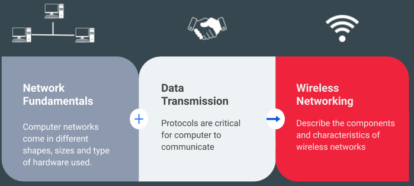

## UWC ISAK IB CS REVIEW 

## 2. The Syllabus

SL/HL core
The topics that must be studied, including some practical work, are:

* Topic 1: System fundamentals (20 hours)

[Link to the review notes #1](https://docs.google.com/document/d/1davsS5s6w4Gz3mCFDHJZwY53Eken14AIiKcCDPrY0Ig/edit?usp=sharing)
[Link to the review notes #2](https://docs.google.com/document/d/19DpTMQbbKNdv6U3X0Lhh9nazSbR_3UrHHjw_eNA5Dvs/edit?usp=sharing)

* Topic 2: Computer organization (6 hours)

1. [Link to the review notes](https://docs.google.com/document/d/16ZTj6Sz8Av3vaKwGk12HYuuz8LbhGmRnWeuu5m2stzU/edit?usp=sharing)

1. [RAM Explained - Random Access Memory](https://www.youtube.com/watch?v=PVad0c2cljo&t=464s)
1. [CPU Cache Explained - What is Cache Memory?](https://www.youtube.com/watch?v=yi0FhRqDJfo)
1. [Motherboards explained](https://www.youtube.com/watch?v=b2pd3Y6aBag&t=4s)
1. [Processor bus: 32 bits versus 64 bits](https://www.youtube.com/watch?v=Wu2A4fpFzgs&t=1s)
1. [Memory and Storage](https://www.pbs.org/video/memory-storage-crash-course-computer-science-19-veum7z/)
1. [Operative systems](https://www.pbs.org/video/operating-systems-crash-course-computer-science-18-wwc9c2/)
1. [Boolean Logic](https://www.pbs.org/video/boolean-logic-logic-gates-crash-course-computer-science-nobmpt/)
1. [Binary and Hexadecimal number representation](https://www.khanacademy.org/computing/code-org/computers-and-the-internet#how-computers-work)
1. [Logic gates]()

* Topic 3: Networks (9 hours)

* Topic 4: Computational thinking, problem-solving and programming (45 hours)

HL extension
The topics that must be studied, including some practical work, are:
* Topic 5: Abstract data structures (23 hours)
* Topic 6: Resource management (8 hours)
* Topic 7: Control (14 hours)

[See more](syllabus.md).

